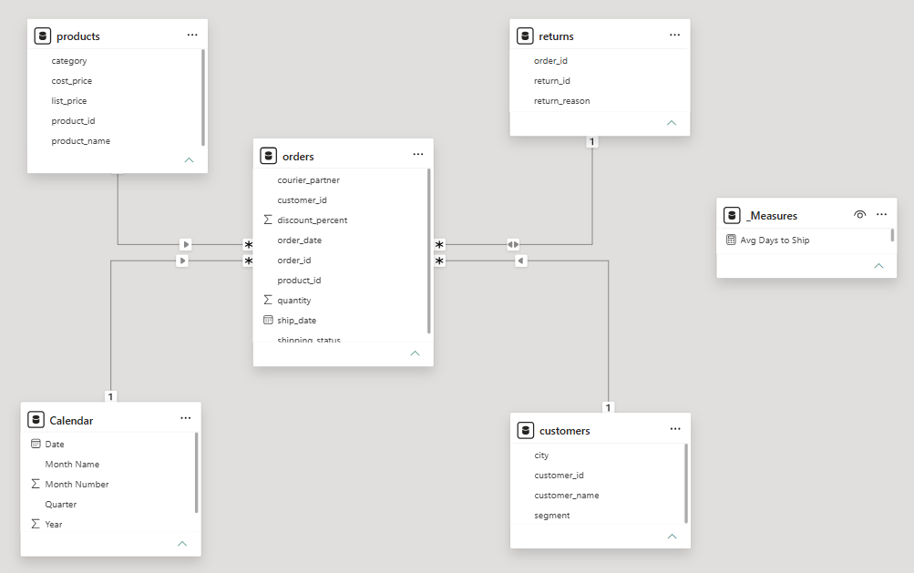
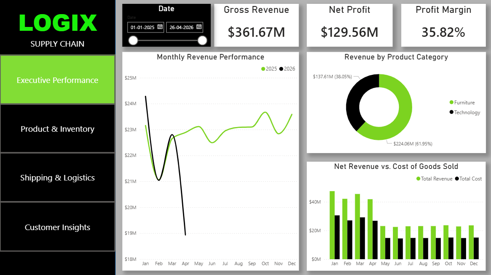
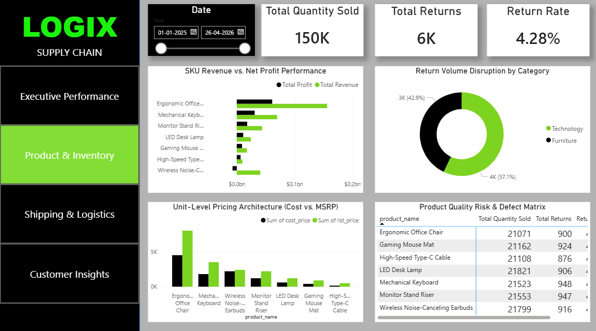
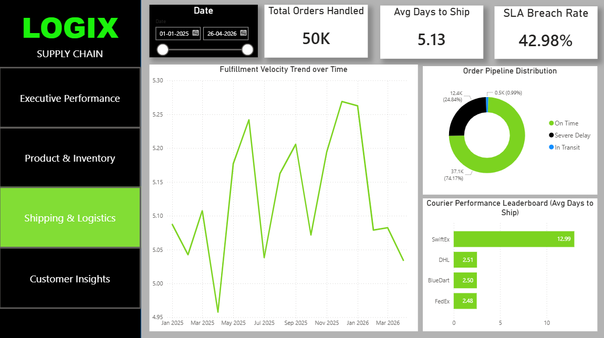
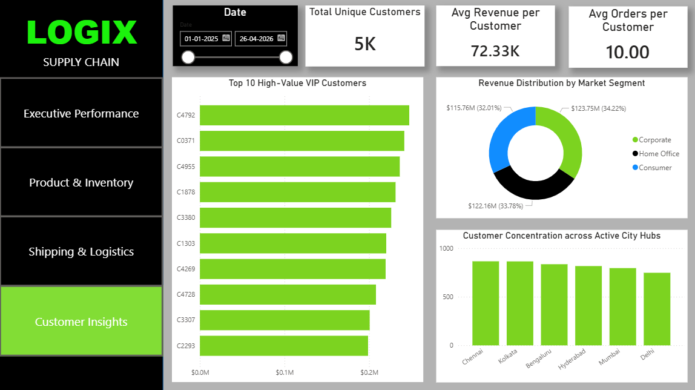

# LOGIX E-Commerce Supply Chain Analytics Dashboard

🚀 [**Click Here to Interact with the Live Dashboard Application**](https://app.powerbi.com/links/_9T5uKIxCF?ctid=29bebd42-f1ff-4c3d-9688-067e3460dc1f&pbi_source=LinkShare)

An enterprise-grade, 4-page Power BI interactive analytics application designed to eliminate operational visibility gaps, maximize net profit margins, diagnose logistics bottlenecks, and track customer lifetime value (CLV). 

This dashboard transforms raw operational transactional datasets into an interactive, insight-driven UI/UX experience structured specifically for C-suite executives, product managers, logistics directors, and marketing teams.

---

## 🏗️ 1. Project Architecture & Data Modeling

The foundation of this application relies on a highly optimized **Star Schema** data model to maximize DAX calculation speeds and ensure clean, predictable filter propagation across all visuals.

### Data Model Components:
*   **Fact Table:** `orders` (Contains transactional records, revenues, order dates, costs, quantities, and operational tracking IDs).
*   **Dimension Tables:** 
    *   `customers` (Demographics, cities, market segments).
    *   `products` (Product categories, SKU nomenclature, unit costs, and retail MSRP).
    *   **`Calendar` (Engineered inside Power BI):** A dedicated, continuous date dimension table built directly inside the application using DAX/Power Query to enable robust Time-Intelligence reporting.
*   **Measures Group:** `_Measures` (A dedicated folder containing all custom business logic, keeping the model completely organized, modular, and scalable).

### 🛠️ Visualizing the Relationships & Filter Directions
*   `Calendar[Date]` ── One-to-Many (──>) ── `orders[order_date]`
*   `customers[customer_id]` ── One-to-Many (──>) ── `orders[customer_id]`
*   `products[product_name]` ── One-to-Many (──>) ── `orders[product_name]`
*   `orders[order_id]` ── Many-to-One (<──>) ── `returns[order_id]` **(Bi-directional Cross-Filtering)**

> **Technical Modeling Note:** The relationship between `orders` and `returns` uses a **Bi-directional cross-filter (`Both`)**. This ensures seamless, synchronized filtering context across both tables, allowing return dimensions (such as return reasons) to instantly slice sales and customer cohorts page-wide without requiring complex DAX bridge measures.



---

## 🧪 2. Core Business Logic & Key DAX Measures

To maintain high performance and precision, all metrics are explicitly declared using custom DAX expressions rather than relying on default implicit fields. Below are the foundational calculations driving the business logic:

```dax
Gross Revenue = SUM(orders[revenue])
```

```dax
Total Profit = SUM(orders[profit])
```

```dax
Profit Margin = DIVIDE([Total Profit], [Gross Revenue], 0)
```

```dax
SLA Breach Rate = 
DIVIDE(
    CALCULATE(COUNT(orders[order_id]), orders[delivery_status] = "SLA Breached"),
    COUNT(orders[order_id]),
    0
)
```

---

## 🎨 3. UI/UX Design System & Theme Layout

The dashboard is structured around a modern web-application interface layout engineered for immediate scanning:
*   **Left Navigation Dock:** A vertical sidebar menu built using a stark **Pure Black (#000000)** background to present a high-contrast corporate identity and house clean navigation links for report tabs.
*   **Top KPI Banner:** Crisp white container cards enhanced with soft drop-shadow layers over a clean light-grey canvas background to create professional visual depth.
*   **Color Palette Rulebook:** 
    *   **Pure Black (#000000):** Structural anchor for the primary navigation hub and deep layout borders.
    *   **Ola Green (#7CD320):** Strictly deployed as a high-impact "Success Signal" to emphasize key performance metrics, selections, and totals.

---

## 📊 4. Module-by-Module Report Breakdown

---

### Page 1: Executive Performance Overview
**Target Audience:** Chief Executive Officer (CEO) & Chief Financial Officer (CFO)  
**Objective:** A high-level view tracking company health, revenue velocity, and macro profit margins.



#### Key Visual Components & Live Metrics:
*   **Top KPI Banner:** Direct visibility into baseline metrics: **Gross Revenue ($361.67M)**, **Net Profit ($129.56M)**, and **Profit Margin (35.82%)**.
*   **Monthly Revenue Performance (Line Chart):** Compares the current year's revenue speed directly against the previous year's baseline trajectory to instantly spot performance momentum shifts.
*   **Revenue by Product Category (Donut Chart):** Highlights macroeconomic inventory value split between core categories (Furniture vs. Technology).
*   **Net Revenue vs. Cost of Goods Sold (Grouped Column Chart):** Tracks monthly cash outlays side-by-side with incoming gross sales to verify operating efficiency.

---

### Page 2: Product & Inventory Intelligence
**Target Audience:** Product Managers & Procurement Directors  
**Objective:** Exposing inventory performance discrepancies, checking retail pricing architectures, and tracking return/defect anomalies.



#### Key Visual Components & Live Metrics:
*   **Top KPI Banner:** Tracks inventory movement health via **Total Quantity Sold (150K)**, **Total Returns (6K)**, and a global **Return Rate (4.28%)**.
*   **SKU Revenue vs. Net Profit Performance (Dual Bar / Tornado Chart):** Visualizes individual item sales alongside actual profits, bringing absolute transparency to top-performing lines.
*   **Unit-Level Pricing Architecture (Clustered Column Chart):** Compares product cost structures by mapping unit costs directly against the set MSRP.
*   **Product Quality Risk & Defect Matrix (High-Density Table):** Ranks items by absolute return volume to immediately isolate low-quality products or defective shipments.

---

### Page 3: Shipping & Logistics Analytics
**Target Audience:** Chief Operating Officer (COO) & Supply Chain Managers  
**Objective:** Identifying fulfillment velocity bottlenecks, tracking carrier efficiency, and maintaining delivery SLA compliance.



#### Key Visual Components & Live Metrics:
*   **Top KPI Banner:** Monitors fulfillment pipelines via **Total Orders Handled (50K)**, **Avg Days to Ship (5.13 days)**, and a critical **SLA Breach Rate (42.98%)**.
*   **Fulfillment Velocity Trend over Time (Line Chart):** Tracks warehouse shipping changes across months to pinpoint exactly when processing lines stall.
*   **Order Pipeline Distribution (Donut Chart):** Breaks down active shipping transit phases (On-Time, Severe Delay, In Transit).
*   **Courier Performance Leaderboard (Horizontal Bar Chart):** Ranks vendors by the exact average days taken to fulfill an order from warehouse to doorstep.

---

### Page 4: Customer Cohort Insights
**Target Audience:** Chief Marketing Officer (CMO) & Customer Success Teams  
**Objective:** Segmenting buyer behaviors, highlighting high-value VIP customer accounts, and mapping regional concentration hubs.



#### Key Visual Components & Live Metrics:
*   **Top KPI Banner:** Displays **Total Unique Customers (5K)** alongside adaptive, morphing KPI cards mapping buyer concentration metrics.
*   **Top 10 High-Value VIP Customers (Horizontal Leaderboard):** Isolates individual buyer accounts to hand marketing teams an instantly actionable loyalty hit-list.
*   **Revenue Distribution by Market Segment (Donut Chart):** Visualizes the percentage spending split across Corporate, Home Office, and Consumer buyer groups.
*   **Customer Concentration across City Hubs (Leaderboard Column Chart):** Ranks volume across active cities, sorted descending by volume. Unmapped "Unknown" database profiles are explicitly filtered out via visual-level filters to maintain strict geographic data integrity.

---

## 🛠️ 5. Advanced UI/UX Optimization & Bug Fixes

During development, a serious layout constraint was identified within the native Power BI Card (New) component. The technical case study and engineering fix are detailed below:

### Bug Case Study: Dynamic Title Truncation & Data Field Conflicts
*   **The Issue:** When trying to inject an expression-driven DAX string into the native Callout Label field well of the new Card container, the rendering engine enforces a rigid single-line restriction. This truncates long corporate terms with an ellipsis (`...`). Furthermore, dropping text measures into the core data bucket causes them to render as duplicate ghost text values inside the card body.
*   **The Technical Resolution:** The text measure was completely removed from the visual data field well. Instead, the global **General > Title** element wrapper was activated, and the dynamic DAX measure was linked via the conditional formatting expression (`fx`) engine with **Text Wrap toggled ON**. This successfully forces descriptive headers to wrap onto multiple lines cleanly while keeping the core callout numbers properly aligned.

#### Implemented Optimization Measures:
```dax
Title Dynamic Revenue Card = 
IF(
    HASONEVALUE(orders[customer_id]), 
    "Customer Lifetime Value (CLV)", 
    "Avg Revenue per Customer"
)
```

```dax
Title Dynamic Orders Card = 
IF(
    HASONEVALUE(orders[customer_id]), 
    "Total Customer Orders", 
    "Avg Orders per Customer"
)
```

---

## 🔄 6. Visual Interactivity & Cross-Filtering Logic

The dashboard uses native interactive relationships to give end-users fluid data-exploration capabilities:
*   **Cross-Filtering:** Selecting a data point (e.g., clicking on a specific VIP customer bar on Page 4) forces the entire page's filter context to squeeze down to that specific row. The denominator shifts from the global population size down to exactly 1, transforming standard "Averages" cards into personalized individual lifetime value snapshots.
*   **Cross-Highlighting:** Selecting category slices within the donut visualizations dims out unrelated background records while keeping the relative proportions highlighted inside adjacent bar charts for quick comparative analysis.

---

## 📈 7. Strategic Business Insights Uncovered

1.  **The Logistics Shipping Bottleneck (Page 3):** The report uncovers that our massive **42.98% SLA Breach Rate** is not a widespread fulfillment failure. It is driven entirely by a single carrier: **SwiftEx**, which is averaging an unacceptable **12.99 days to ship**. Since competing vendors (DHL, BlueDart, FedEx) all average under 2.6 days, the immediate recommendation is to reallocate contract shipping volume away from SwiftEx to dramatically lower delivery delays.
2.  **The Margin Deficit (Page 2):** Product deep-dives expose that while certain inventory groups drive massive gross sales, the **Wireless Earbuds** product line is actively losing money—operating at a **negative profit** due to aggressive promotional markdown structures and high return cycles.
3.  **VIP Outlier Concentration (Page 4):** Cross-filtering isolates that our top-tier customer whale cohort spends significantly more than the average store buyer base (e.g., Customer `C4792` has single-handedly generated **$247.50K across 23 unique orders**). This directly justifies a strategic shift toward dedicated B2B corporate account loyalty programs.